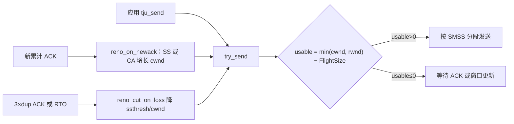
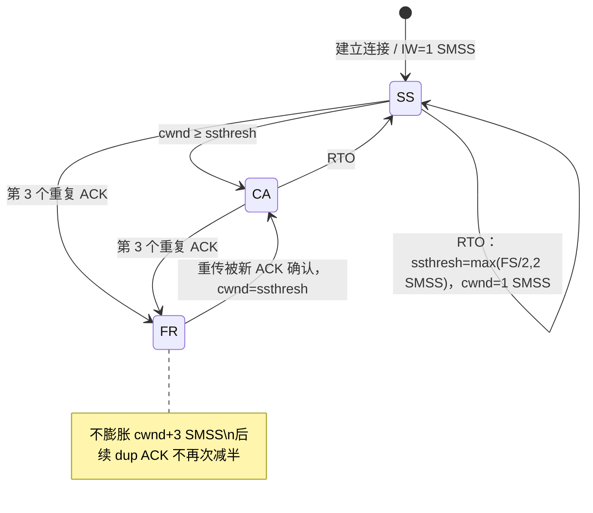

# 第七部分　基础 Reno 拥塞控制的设计与实现（第三阶段 · 子任务一）

> 用途：将本节内容填入《计算机网络实践课程报告模版-2026-V3》**第七部分**；同步更新 **2.2 需求追踪矩阵 R4**、**附录 B 第三阶段（子任务一）**。  
> 对应代码：`tju_tcp/inc/global.h`（`cwnd`/`ssthresh`/`cc_state`）、`tju_tcp/src/tju_tcp.c`（`reno_on_newack`、`reno_cut_on_loss`、`send_window`、event.trace）。  
> 实验入口：`tju_tcp/test/cc_client.c`、`test/cc_server.c`（**不要**加入 `test/Makefile`，以免干扰自动测试编译）。  
> 原始 trace：`tju_tcp/logs/cc1_*.event.trace`（无丢包）、`cc2_*.event.trace`（2% 丢包）、`cc4_*.event.trace`（小 rwnd）。  
> 绘图脚本：`tju_tcp/test/plot_cc.py`。图表：`tju_tcp/logs/cc1_wnd.png`、`cc2_wnd.png`、`cc4_wnd.png`。  
> 实验日期：2026-09-16。默认网络：时延 20 ms、带宽 100 Mbps；丢包与接收缓冲实验另行标注。  
> 说明：必做内容是慢启动、拥塞避免，以及 RTO 超时或三次重复 ACK 表明丢包后的窗口减小；**完整快速恢复不是必做内容，本实现未选做**。

---

## 2.2 需求追踪矩阵（本子任务更新 R4）

| ID | 任务要求 | 报告对应章节 | 实现模块 | 测试/结果 |
|----|----------|--------------|----------|-----------|
| R1 | 连接建立与关闭 | 5.1–5.4 | `tju_connect` / `tju_listen` / `tju_accept` / `tju_close` / `tju_handle_packet` | 第二阶段已通过；本子任务回归握手/挥手未改接口 |
| R2 | 可靠数据传输 | 6.1–6.3、6.6 | `tju_send` / `tju_recv` / `handle_data` / `handle_ack` / `try_send` | 本子任务 1 MB 无丢包与 2% 丢包均完整交付 |
| R3 | 流量控制 | 6.4、6.7 | `calc_adv_wnd`、`peer_rwnd`、零窗口探测 | 本子任务 TC-CC4：`TJU_RECV_CAP=5500` 时 `swnd≤5500` |
| R4 | 基础 Reno | 7.1–7.5 | `reno_on_newack`、`reno_cut_on_loss`、`send_window=min(rwnd,cwnd)`；event.trace | TC-CC1～TC-CC4；图 7-1～图 7-3；`logs/cc1_client.event.trace` 等 |
| R5 | 性能评价与复现 | 8 | 待第三阶段子任务二 | 待填写 |

---

## 7.1 关键变量

依据 RFC 5681 §2 与说明书 §5.5、§7。单位除特别说明外均为**字节**。`SMSS` 取框架 `MAX_DLEN=1375`（报文总长上限 1400、固定头 20，与第二阶段一致，保证 `plen≤MAX_LEN`）。

| 变量 | 含义 | 初始值 | 更新位置 |
|------|------|--------|----------|
| `SMSS` | 发送端最大报文**数据**长度，不含 20 字节头 | 1375 | `inc/global.h` 宏 |
| `cwnd` | 拥塞窗口，发送端估计的网络可承载在途量 | `INIT_CWND=1×SMSS=1375` | `reno_on_newack` 增长；`reno_cut_on_loss` 降低 |
| `ssthresh` | 慢启动阈值 | `INIT_SSTHRESH=ADV_WND_MAX=65535`（课程允许的最大接收窗口） | 丢包时 `max(FlightSize/2, 2×SMSS)` |
| `rwnd` | 对端最近通告的接收窗口（16 位字段，饱和时本端按 `SEND_FLIGHT_MAX` 理解更大缓冲） | 握手后取 SYN-ACK/ACK 的 Advertised Window | `tju_handle_packet` 写入 `peer_rwnd` |
| `FlightSize` | 已发送尚未累计确认的数据字节数 | 0 | `snd_nxt − snd_una` |
| `cc_state` | `SLOW_START` / `CONGESTION_AVOIDANCE` | `SLOW_START` | 窗口跨过 `ssthresh`、RTO、三次 dup ACK |
| 发送上限 | 实际允许在途量 | — | `min(cwnd, peer_rwnd_cap)`，实现于 `send_window()` |

RFC 5681 的初始窗口公式为 `IW=min(4×SMSS, max(2×SMSS, 4380))`，在 `SMSS=1375` 时等于 4380。第一阶段对照 RFC 后采用更保守的 `IW=1×SMSS`：增长不比 RFC 更激进，且慢启动曲线可从 1 个满载段看清。`SYN`/`SYN-ACK` 的确认**不**增加 `cwnd`（握手走 `SYN_SENT`/`SYN_RECV` 分支，不调用 `reno_on_newack`）。



---

## 7.2 慢启动与拥塞避免

### 7.2.1 进入 / 退出条件

| 阶段 | 进入 | 退出 |
|------|------|------|
| 慢启动 | 连接建立；或 RTO 后 `cwnd=1×SMSS` | `cwnd ≥ ssthresh` 转入拥塞避免；或丢包转入降窗 |
| 拥塞避免 | `cwnd ≥ ssthresh`；或三次 dup ACK 后重传被新 ACK 确认 | RTO 回到慢启动；再次三次 dup ACK 再次降窗 |

### 7.2.2 按 ACK 更新（不比 RFC 5681 更激进）

仅当 ACK **推进累计确认点**且连接已 `ESTABLISHED`/`CLOSE_WAIT` 时增长。单次增加不超过 1×SMSS。

```
# 慢启动（每个确认新数据的 ACK）
N = newly_acked
cwnd += min(N, SMSS)
if cwnd >= ssthresh: 进入拥塞避免

# 拥塞避免（约每个 RTT 增加 1×SMSS）
cwnd_accum += newly_acked
if cwnd_accum >= cwnd:
    cwnd_accum = 0
    cwnd += SMSS          # 每个 ACK 最多 +1 SMSS，避免大块累计 ACK 一次加多段
```

无丢包时 `ssthresh=65535`，慢启动持续到 `cwnd` 跨过该阈值。实验 TC-CC1：最后一次慢启动 `size:64625`，下一 ACK `size:66000` 且 `type:1`，即 `64625+1375=66000≥65535`，与实现一致。

---

## 7.3 丢包后的窗口变化

未实现完整快速恢复（RFC 5681 §3.2 的窗口膨胀、重复 ACK 期间发新数据、恢复 ACK 后收缩）。三次 dup ACK 只做**基本快速重传 + 降窗**；新 ACK 到达后令 `cwnd=ssthresh` 进入拥塞避免。



| 事件 | `ssthresh` | `cwnd` | 重传 | 随后阶段 |
|------|------------|--------|------|----------|
| RTO 超时 | `max(FlightSize/2, 2×SMSS)` | `1×SMSS`（不超过一个 SMSS） | 最早未确认段（不整窗回退） | 慢启动 |
| 第 3 个重复 ACK | 同上 | 立即降为 `ssthresh`（**无** `+3×SMSS`） | 最早未确认段 | 置 `fast_rexmit_pending`；新 ACK 后 `cwnd=ssthresh` 进入拥塞避免 |
| 快速重传后的后续 dup ACK | 不变 | 不变 | 不再触发降窗 | 等待累计 ACK 推进 |

实现要点：`dupacks==3 && !fast_rexmit_pending` 才调用 `reno_cut_on_loss`；降窗时**不**把 `dupacks` 清零，避免后续重复 ACK 把窗口连续减半。数据路径 RTO 改为只重传 `segs[0]`，与说明书 §5.3 第 10 款一致。

---

## 7.4 设计—实现—测试汇总表

| 机制 | 设计要点 | 实现文件/函数 | 预期行为 | 测试用例 | 证据 |
|------|----------|---------------|----------|----------|------|
| 慢启动 | `cwnd<ssthresh` 时每新 ACK 最多 +1 SMSS | `reno_on_newack` | cwnd 按 ACK 快速增长 | TC-CC1 | 图 7-1；`cc1_client.event.trace` `type:0` 1375→64625 |
| 拥塞避免 | `cwnd≥ssthresh` 时约每 RTT +1 SMSS | `reno_on_newack` | 线性缓增，不比 Reno 更激进 | TC-CC1 | 图 7-1 约 0.58 s 后 `type:1` 66000→83875 |
| RTO 丢包 | `ssthresh=max(FS/2,2 SMSS)`，`cwnd=1 SMSS`，重传最早段 | `reno_cut_on_loss(...,1)`，`do_retransmit` | 降窗并重新慢启动 | TC-CC2 | 图 7-2 红叉；`type:3 size:1375` 后 `type:0 size:2750` |
| 三次重复 ACK | 基本快速重传 + 降窗；无窗口膨胀 | `handle_ack`，`reno_cut_on_loss(...,0)` | 第 3 个 dup ACK 重传并减半 | TC-CC2 | 图 7-2 橙点；`cwnd` 30250→15125，重发 `seq:28876` |
| rwnd 约束 | 在途量 ≤ `min(rwnd,cwnd)` | `send_window` / `try_send` | cwnd 再大也不能超过通告窗口 | TC-CC4 | 图 7-3；`cwnd→68750` 而 `swnd≤5500` |

---

## 7.5 基础 Reno 测试

**公共环境：** 宿主机 Windows 10；client `172.17.0.2`、server `172.17.0.3`；时延 20 ms、带宽 100 Mbps。程序每次启动覆盖 `/vagrant/tju_tcp/test/{client,server}.event.trace`。实验后将文件复制到 `tju_tcp/logs/` 以免被下次运行覆盖。

复现（在对应虚拟机执行；共享盘上的 ELF 请先 `cp` 到 `/tmp` 再 `chmod +x`）：

```bash
# 两端
cd /vagrant/tju_tcp && make
gcc -pthread -g -I./inc ./test/cc_server.c -o test/cc_server ./build/*.o
gcc -pthread -g -I./inc ./test/cc_client.c -o test/cc_client ./build/*.o
cp test/cc_server /tmp/cc_server && chmod +x /tmp/cc_server
cp test/cc_client /tmp/cc_client && chmod +x /tmp/cc_client

# server
sudo tcset enp0s8 --rate 100Mbps --delay 20ms --overwrite
/tmp/cc_server

# client（TC-CC1）
sudo tcset enp0s8 --rate 100Mbps --delay 20ms --overwrite
/tmp/cc_client 1048576
```

绘图：`python tju_tcp/test/plot_cc.py tju_tcp/logs/cc1_client.event.trace cc1 tju_tcp/logs`

Trace 格式按《Trace文件记录说明-v1》：`[utctimestamp] [event] [info]`，时间戳为微秒（16 位），`flag` 用数字（8=SYN，12=SYN\|ACK，4=ACK），窗口单位为字节。

### TC-CC1　无丢包：慢启动 → 拥塞避免

- **条件：** 丢包 0%；服务端尽快 `tju_recv`，rwnd 充足；客户端发送 1 MB。
- **预期：** `cwnd` 从 1375 按 ACK 倍增式上升；跨过 65535 后 `type` 从 0 变为 1，之后约每 RTT 增加 1375；握手 ACK 不增加 `cwnd`；服务端实收 1 MB。
- **实际：** 通过。服务端 `[CC] server got 1048576 bytes`。首个数据 ACK 后 `cwnd` 1375→2750（`type:0`）。约 0.58 s 处 `64625`（SS）→`66000`（CA）。随后 CA 段 66000、67375、…、83875，级差均为 1375。全程无 `type:2/3`。
- **关键 trace（`cc1_client.event.trace`）：**

```
[1789526560844362] [SEND] [seq:0 ack:0 flag:8 length:0]     # SYN，不增 cwnd
[1789526560896146] [RECV] [seq:1 ack:1 flag:12 length:0]    # SYN-ACK
[1789526560899078] [CWND] [type:0 size:1375]               # 进入 ESTABLISHED，IW
[1789526560900152] [SEND] [seq:1 ack:2 flag:4 length:1375]
[1789526560952192] [RECV] [seq:2 ack:1376 flag:4 length:0]
[1789526560954150] [CWND] [type:0 size:2750]               # 慢启动 +1 SMSS
[1789526561423282] [CWND] [type:0 size:64625]
[1789526561429140] [CWND] [type:1 size:66000]              # 进入拥塞避免
```


图 7-1：约 0–0.58 s 为慢启动（台阶变密、斜率变大）；此后为拥塞避免（近线性）。因对端通告饱和，发送窗口与 `cwnd` 重合，说明此时瓶颈在拥塞窗口而非接收窗口。

### TC-CC2　2% 丢包：三次重复 ACK 与 RTO

- **条件：** 两端 `tcset --loss 2%`；发送 1 MB。
- **预期：** 出现 `type:2`（快速重传降窗）且 `cwnd≈FlightSize/2`；立即重传最早未确认段；后续 dup ACK 不再次减半。若整窗丢失则 `type:3` 且 `cwnd=1375`，随后慢启动。数据完整交付。
- **实际：** 通过。服务端收齐 1048576 B。14 次快速重传、6 次 RTO。首次 FR：三个 `RECV ack:28876` 后 `cwnd` 由 30250（SS）降为 15125（恰好一半），并立刻 `SEND seq:28876`（丢失段）。同一轮后续 dup ACK **没有**新的 `type:2`。首次 RTO：`type:3 size:1375`，重发 `seq:334973`，下一新 ACK 后 `type:0 size:2750` 重新慢启动。
- **关键 trace（`cc2_client.event.trace`）：**

```
[1789526736114728] [CWND] [type:0 size:30250]
[1789526736116703] [RECV] [seq:2 ack:28876 flag:4 length:0]
[1789526736117661] [RECV] [seq:2 ack:28876 flag:4 length:0]
[1789526736118484] [RECV] [seq:2 ack:28876 flag:4 length:0]
[1789526736118523] [CWND] [type:2 size:15125]              # 3×dup ACK，ssthresh=FS/2
[1789526736119568] [SEND] [seq:28876 ack:2 flag:4 length:1375]  # 快速重传
[1789526737524039] [CWND] [type:3 size:1375]               # RTO，cwnd=1 SMSS
[1789526737525010] [SEND] [seq:334973 ack:2 flag:4 length:1375]
[1789526737571785] [CWND] [type:0 size:2750]               # 重新慢启动
```


图 7-2：经典 Reno 锯齿。橙点为三次 dup ACK 降窗，红叉为超时把 `cwnd` 拉回 1×SMSS。未见完整快速恢复的“膨胀后再收缩”平台，与必做边界一致。

### TC-CC4　小 rwnd：在途量受 `min(rwnd,cwnd)` 约束

- **条件：** 服务端 `TJU_RECV_CAP=5500`，尽快读取；0% 丢包；客户端发送 256 KB。
- **预期：** 即使慢启动把 `cwnd` 增到数万字节，`SWND` 仍不超过约 5500；服务端 `RWND` 在 2750–5500 间随缓冲占用波动；数据完整。
- **实际：** 通过。服务端收齐 262144 B。客户端 `cwnd` 仍按 SS 增至 64625 并进入 CA（68750），但 `SWND` 最大值 **5500**，出现次数最多的发送窗口为 2750/4125。服务端 `RWND` 初始 5500，与 `TJU_RECV_CAP` 一致。
- **关键 trace：**

```
# server.event.trace
[1789527158308128] [RWND] [size:5500]
[1789527158363191] [DELV] [seq:1 size:1375]
[1789527158364465] [RWND] [size:4125]

# client.event.trace：cwnd 已达 68750，swnd 仍 ≤5500
[1789527160440236] [CWND] [type:1 size:68750]
[1789527161349338] [SWND] [size:5500]
```


图 7-3：蓝线 `cwnd` 继续慢启动/拥塞避免；橙线 `swnd=min(cwnd,rwnd)` 贴在约 5.5 KB。证明在途数据同时受接收窗口与拥塞窗口约束，二者未混用。

### 测试小结

| 用例 | 网络 / 缓冲 | 发送量 | 结果 | 原始文件 |
|------|-------------|--------|------|----------|
| TC-CC1 | 0% 丢包，默认 rwnd | 1 MB | SS→CA，无降窗 | `logs/cc1_client.event.trace` |
| TC-CC2 | 2% 丢包 | 1 MB | 14 次 FR、6 次 RTO，数据完整 | `logs/cc2_client.event.trace` |
| TC-CC4 | 0% 丢包，`TJU_RECV_CAP=5500` | 256 KB | `cwnd≫swnd`，`swnd≤5500` | `logs/cc4_client.event.trace` |

未选做完整快速恢复、NewReno、SACK/RACK、CUBIC。局限性：无丢包时 `ssthresh=65535`，拥塞避免出现较晚；2% 丢包下 RTO 与快速重传可能交替出现，属基本 Reno 在无 SACK 时对多段丢失的已知限制。

---

## 7.6 代表性 AI 协作与验证记录

| 项目 | 内容 |
|------|------|
| 所在阶段 | 第三阶段 · 子任务一（模块设计 + 编程实现 + trace 判读） |
| 工具信息 | Cursor（Grok 4.6） |
| 使用目的 | 按说明书 §5.5、指导书 §6.3.1、RFC 5681 §3.1 实现基础 Reno，并按 Trace 说明输出 `client/server.event.trace` |
| 提示与上下文摘要 | 现有 `try_send`/`handle_ack`/`do_retransmit`；`SMSS=1375`；必做不含完整快速恢复；官方 trace 字段与 flag 数字编码 |
| AI 建议摘要 | ① `send_window=min(cwnd,rwnd)`；② SS 每 ACK +min(N,SMSS)，CA 按字节累加约每 RTT +1 SMSS；③ RTO：`ssthresh=max(FS/2,2 SMSS)`、`cwnd=SMSS`；④ 三次 dup ACK 降窗后新 ACK 置 `cwnd=ssthresh`；⑤ 按课程格式写 event.trace |
| 人工处理 | **采用** 上述窗口公式与官方 trace 字段。**拒绝** 完整快速恢复的 `cwnd=ssthresh+3×SMSS` 膨胀（属挑战任务）。**拒绝** 首次 AI 草稿在每次 dup ACK 后把 `dupacks` 清零——实测会把窗口连续减半（`type:2` 同一 `size` 重复 9 次）；改为 `fast_rexmit_pending` 期间不再降窗。**修改** 数据 RTO 由整窗 `retransmit_all` 改为只重传最早未确认段。**修改** `tju_recv` 在 `CLOSE_WAIT` 且缓冲空时返回 0，否则实验服务端在 FIN 后阻塞 |
| 验证方法 | `gcc` 编译通过；TC-CC1 对照 RFC 核算 `64625+1375=66000`；TC-CC2 逐条核对 3 个重复 ACK、`30250/2=15125` 与重传序号；TC-CC4 核对 `swnd≤5500`；图表由 `plot_cc.py` 从原始 trace 生成 |
| 关联证据 | `src/tju_tcp.c` 中 `reno_*`；`logs/cc1_wnd.png`、`cc2_wnd.png`、`cc4_wnd.png`；本节 7.4–7.5 |

---

## 附录 B　第三阶段进度摘要（子任务一）

| 阶段 | 完成内容 | 未完成/遗留问题 | 下一步 |
|------|----------|-----------------|--------|
| 第三阶段 · 子任务一（本周进行中） | 基础 Reno：`cwnd`/`ssthresh`、慢启动、拥塞避免、RTO 与三次 dup ACK 降窗、`min(rwnd,cwnd)` 发送上限；官方 event.trace；TC-CC1/2/4 与可复现图表 | 未做完整快速恢复（有意裁剪）；100 MB 联调与对照性能实验属子任务二；线上拥塞控制无自动评分，以 trace/图表验收 | 子任务二：多条件联调与吞吐率对照；子任务三：最终报告与答辩材料 |
