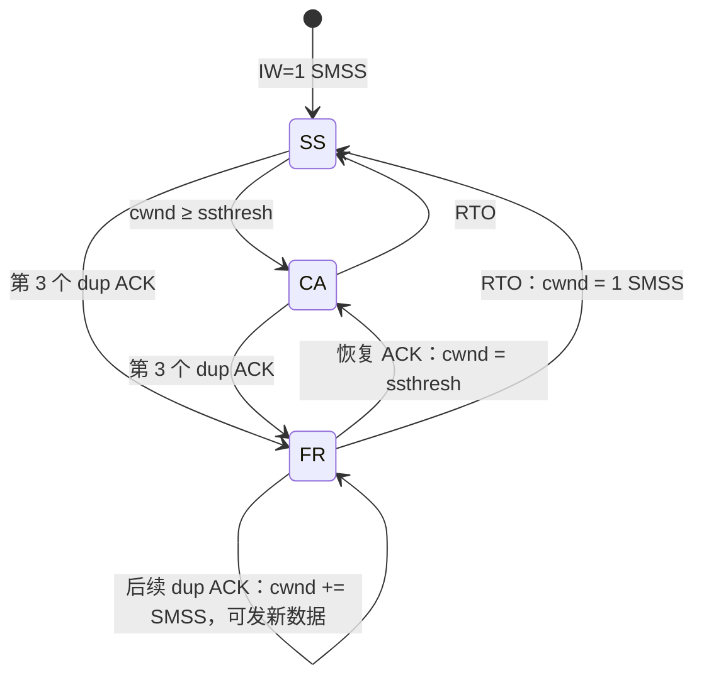

# 第九部分　挑战任务：完整 Reno 快速恢复

> 用途：填入《计算机网络实践课程报告模版-2026-V3》**第九部分**；勾选「完整 Reno 快速恢复」。同步更新 **附录 B 第三阶段（挑战任务）**。  
> 标准：RFC 5681 §3.2；说明书 §5.6 第 1 款、指导书 §6.4 第 1 款。  
> 代码：`tju_tcp/src/tju_tcp.c`（`reno_enter_fast_recovery`、`reno_fr_on_dupack`、`reno_exit_fast_recovery`），状态 `FAST_RECOVERY`（`inc/global.h`）。  
> **不替代**第七部分基础 Reno：无丢包时慢启动/拥塞避免、RTO 降到 1×SMSS 的行为保持不变。  
> 独立测试：`test/cc_client.c` / `cc_server.c` + `test/run_fr.py`。  
> 原始 trace：`tju_tcp/logs/fr0_*.event.trace`（0% 回归）、`fr2_*.event.trace`（2% 丢包）。对照基线：`logs/cc2_client.event.trace`（基础 Reno，仅降窗、无膨胀）。  
> 图表：`logs/fr0_wnd.png`、`fr2_wnd.png`、`fr2_zoom.png`。绘图：`test/plot_cc.py`。  
> 实验日期：2026-09-17。网络：100 Mbps、单程 20 ms；载荷 1 MB。

---

## 9.1 标准依据、前置条件与设计

### 9.1.1 依据与前置

| 项 | 内容 |
|----|------|
| RFC | RFC 5681 **§3.2 Fast Retransmit/Fast Recovery** 步骤 1–6 |
| 课程 | 说明书 §5.6：「第三个重复 ACK 触发后的拥塞窗口膨胀、重复 ACK 期间的新数据发送，以及恢复 ACK 到达后的窗口收缩」 |
| 前置 | 已通过的基础 Reno（§5.5）：`cwnd`/`ssthresh`、慢启动、拥塞避免、三次 dup ACK 快速重传、RTO 降窗、`min(rwnd,cwnd)` |
| 明确不做 | **NewReno**（RFC 6582 部分确认继续恢复）；**Limited Transmit**（RFC 3042，第 1–2 个 dup ACK 发新数据）；SACK / RACK / CUBIC |

基础 Reno（第七部分）在第 3 个 dup ACK 后令 `cwnd=ssthresh`，新 ACK 再进入拥塞避免，**没有** `+3×SMSS` 膨胀，后续 dup ACK **不**增加窗口、也**不**趁机发送新数据。完整快速恢复补的就是这三步，使管道在丢失段重传期间仍尽量保持在途量。

### 9.1.2 状态与关键量

沿用已有 `cc_state`，启用原先预留的 `FAST_RECOVERY`。`SMSS=1375`（与必做一致，`MAX_DLEN`）。

| 变量 | 含义 |
|------|------|
| `ssthresh` | 第 3 个 dup ACK 时 `max(FlightSize/2, 2×SMSS)`，恢复结束前不变 |
| `cwnd` | 进入 FR：`ssthresh+3×SMSS`；每个额外 dup ACK：`+1×SMSS`；恢复 ACK：缩回 `ssthresh` |
| `FlightSize` | `snd_nxt−snd_una`，丢失段在被累计确认前仍计入在途 |
| 发送上限 | 仍为 `min(cwnd, rwnd)`；膨胀后的 `cwnd` 大于 `FlightSize` 时 `try_send` 发送**新**数据 |



### 9.1.3 与基础 Reno 的逐步对照（RFC 5681 §3.2）

| 步骤 | RFC 5681 | 基础 Reno（必做） | 完整 Reno（本挑战） |
|------|----------|-------------------|---------------------|
| 1 | 第 3 个 dup ACK：`ssthresh=max(FS/2,2 SMSS)` | 相同 | 相同 |
| 2 | 重传最早未确认段 | 相同 | 相同 |
| 3 | **`cwnd=ssthresh+3×SMSS`（膨胀）** | `cwnd=ssthresh`（不膨胀） | **按 RFC 膨胀** |
| 4–5 | 之后每个 dup ACK `cwnd+=SMSS`，若窗口允许则发新数据 | 窗口不变，不发新数据 | **按 RFC 膨胀并 `try_send`** |
| 6 | 确认新数据的 ACK：`cwnd=ssthresh`，退出 FR 进 CA | 新 ACK 时 `cwnd=ssthresh` 进 CA（窗口本来就等于 ssthresh，无「收缩」落差） | **从膨胀值收缩到 ssthresh** |

Reno（非 NewReno）下，**任何**推进 `snd_una` 的 ACK 都退出 FR。若该 ACK 只覆盖空洞后的一部分（部分确认），后续空洞需重新凑齐 3 个 dup ACK。这是完整 Reno 相对 NewReno 的已知局限，本实现按选做范围保留。

### 9.1.4 伪代码

```
# 第 3 个纯 dup ACK 且不在 FR
ssthresh = max(FlightSize/2, 2*SMSS)
cwnd     = ssthresh + 3*SMSS
重传 segs[0]
cc_state = FAST_RECOVERY
try_send()                    # 此时往往 FlightSize > cwnd，还需更多 dup ACK 才发得出新数据

# FR 中的后续纯 dup ACK
cwnd += SMSS
try_send()                    # 一旦 cwnd > FlightSize 且 rwnd 允许，发送 snd_nxt 处的新段

# FR 中推进 snd_una 的 ACK（恢复 ACK，含部分确认）
cwnd = ssthresh
cc_state = CONGESTION_AVOIDANCE
# 本 ACK 不再做 SS/CA 增长

# RTO（含 FR 期间）
ssthresh = max(FlightSize/2, 2*SMSS)
cwnd = 1*SMSS
cc_state = SLOW_START
```

event.trace：进入与每次膨胀写 `CWND type:2`；收缩写 `type:1`；RTO 仍为 `type:3`。与《Trace文件记录说明》及 `gen_graph_win.py` 的 0/1/2/3 编码兼容。

---

## 9.2 实现、独立测试与对比分析

### 9.2.1 实现落点

| 函数 | 作用 |
|------|------|
| `reno_enter_fast_recovery` | 第 3 个 dup ACK：设 ssthresh、膨胀、`cc_state=FAST_RECOVERY` |
| `reno_fr_on_dupack` | FR 内每个额外 dup ACK：`cwnd+=SMSS` |
| `reno_exit_fast_recovery` | 恢复 ACK：收缩并进 CA |
| `reno_cut_on_loss` | 仅处理 **RTO**（退出 FR，`cwnd=1 SMSS`） |
| `handle_ack` | dup ACK 分发进入/膨胀；新 ACK 走 `reno_on_newack`（若在 FR 则只收缩） |
| `try_send` | 膨胀后 `usable=cwnd−FlightSize>0` 时发送新数据 |

`TJU_DISABLE_CC` / `TJU_FIXED_WND` 时不进入 FR，以免破坏第八部分窗口冻结实验。未改内核、报文格式与八个规定接口。

工作区即可识别本改动（相对第七部分基础 Reno）；未另开 git 分支、未在本任务中提交。若课程要求「独立提交」，可在当前工作区单独 `commit` 本文件集合。

### 9.2.2 独立测试

公共环境与第七部分相同：client `172.17.0.2` / server `172.17.0.3`，`enp0s8`。trace 写 `/tmp` 后备份到 `logs/`（避免覆盖 `cc1`/`cc2`）。

```bash
# 在 client 上
python3 /vagrant/tju_tcp/test/run_fr.py
python tju_tcp/test/plot_cc.py tju_tcp/logs/fr0_client.event.trace fr0 tju_tcp/logs
python tju_tcp/test/plot_cc.py tju_tcp/logs/fr2_client.event.trace fr2 tju_tcp/logs
```

| 用例 | 条件 | 预期 | 结果 |
|------|------|------|------|
| TC-FR0 | 0% 丢包，1 MB | 仅 SS→CA，无 `type:2/3`；交付 1048576 B | 通过。61 次 CWND：`type:0` 47 次、`type:1` 14 次 |
| TC-FR2 | 2% 丢包，1 MB | 出现膨胀台阶、恢复 ACK 收缩、FR 期间新数据 SEND；交付完整 | 通过。153 次 `type:2`，4 次 RTO；服务端 1048576 B |

### 9.2.3 TC-FR0　无丢包回归

与 TC-CC1 同类：慢启动至跨过 65535 后拥塞避免。图 9-1 无橙点/红叉，说明快速恢复不会在无损路径上误触发。


### 9.2.4 TC-FR2　2% 丢包：膨胀、新数据、收缩

**第一次快速恢复（逐条可核算）：**

三次 `RECV ack:123751` 之后：

```
[1789652785023547] [RECV] [seq:2 ack:123751 flag:4 length:0]   # 第 3 个 dup ACK
[1789652785023549] [CWND] [type:2 size:37125]                 # ssthresh+3×SMSS
[1789652785023555] [SEND] [seq:123751 ...]                    # 快速重传丢失段
[1789652785023561] [CWND] [type:2 size:38500]                 # +1375
... 每个后续 dup ACK +1375 ...
[1789652785070959] [CWND] [type:2 size:94875]
[1789652785070970] [SEND] [seq:217251 ...]                    # FR 期间的新数据（进入前最后新段为 seq:188376）
[1789652785070982] [RECV] [seq:2 ack:156751 ...]              # 恢复 ACK，推进 snd_una
[1789652785071018] [CWND] [type:1 size:33000]                 # 收缩到 ssthresh
```

核算：

- `37125 − 3×1375 = 33000` → 进入时 `ssthresh=33000`  
- 该段共 43 次 `type:2`：1 次进入 + 42 次 `+SMSS`；`33000 + (3+42)×1375 = 94875`  
- 恢复 ACK 后 `cwnd=33000`，落差 `94875−33000=61875=45×SMSS`，与膨胀量一致  
- 进入 FR 前最后新数据 `seq:188376`；恢复结束前出现 `seq:209001`、`217251` 等，证明步骤 5「发送新数据」

基础 Reno 对照（`cc2_client.event.trace` 首次 FR）：三次 dup ACK 后 **一次** `type:2 size:15125`（恰为当时窗口的一半），随后窗口不再因 dup ACK 上升，也没有「先膨胀再掉回 ssthresh」的落差。


图 9-2：橙柱为每次 dup ACK 把 `cwnd` 抬高；柱顶之后立刻掉到较低平台，即恢复 ACK 收缩。红叉仍为 RTO（`cwnd=1375` 再慢启动）。与图 7-2 基础 Reno「只有降窗点、没有膨胀柱」可对照。


图 9-3：约 410 ms 处从 37125 逐级加到 94875，绿点落到虚线 `ssthresh=33000`。

### 9.2.5 与基础 Reno 的对比小结

| 指标（2% 丢包、1 MB，条件同为 100 Mbps/20 ms） | 基础 Reno（`cc2`） | 完整 Reno（`fr2`） |
|-----------------------------------------------|--------------------|--------------------|
| 服务端交付 | 1048576 B | 1048576 B |
| `CWND type:2` 次数 | 14（每次 FR 仅 1 条，无膨胀过程） | 153（进入 + 每个额外 dup ACK） |
| 首次 FR 窗口形态 | `30250→15125` 后持平 | `37125→…→94875→33000` |
| 首次 FR 是否发新数据 | 否（窗口不膨胀） | 是（`seq` 从 188376 推进到 217251） |
| `type:3` RTO 次数 | 6 | 4 |

两次实验的 netem 丢包是独立随机过程，RTO 次数不可作严格统计结论；窗口**形状**（膨胀台阶 + 收缩落差）与 RFC 公式逐条相符，这是机制对比的证据。收益：丢失段重传期间可用 dup ACK 把窗口抬到 `FlightSize` 以上，继续发送新数据，减少空窗。代价：实现与判读更复杂；无 SACK 时部分确认仍退出 FR，单窗口多段丢失仍可能再次 FR 或 RTO。未完成：NewReno 的 `recover` 高水位、Limited Transmit、SACK 记分板。

### 9.2.6 代表性 AI 协作与验证记录

| 项目 | 内容 |
|------|------|
| 所在阶段 | 第三阶段 · 挑战任务（完整 Reno） |
| 工具信息 | Cursor（Grok 4.6） |
| 使用目的 | 在已冻结的基础 Reno 上按 RFC 5681 §3.2 补全快速恢复，并用独立 trace 对照第七部分 |
| AI 建议摘要 | 进入 FR 时 `cwnd=ssthresh+3 SMSS`；后续 dup ACK `+SMSS` 后 `try_send`；恢复 ACK 只收缩、不再做 SS/CA 增长 |
| 人工处理 | **采用**上述三步。**拒绝**把部分确认留在 FR 内（那是 NewReno）。**拒绝**在第 1–2 个 dup ACK 发新数据（Limited Transmit）。**验证** `37125−3×1375=33000` 与收缩目标一致，且 `+1375` 步长贯穿 42 次膨胀 |
| 关联证据 | `logs/fr2_client.event.trace` 第 337–489 行；图 9-2、图 9-3；`logs/cc2_client.event.trace` |

---

## 附录 B　第三阶段进度摘要（挑战任务）

| 阶段 | 完成内容 | 未完成/遗留问题 | 下一步 |
|------|----------|-----------------|--------|
| 挑战任务：完整 Reno 快速恢复 | RFC 5681 §3.2 膨胀、dup ACK 发新数据、恢复 ACK 收缩；TC-FR0/FR2；与基础 Reno `cc2` 对照 | 未做 NewReno/SACK/Limited Transmit；有损对照受 netem 随机性影响，未做同种子逐包对比 | 按课程要求单独提交挑战材料；答辩时能用 37125/33000/94875 三组数字讲清膨胀与收缩 |
