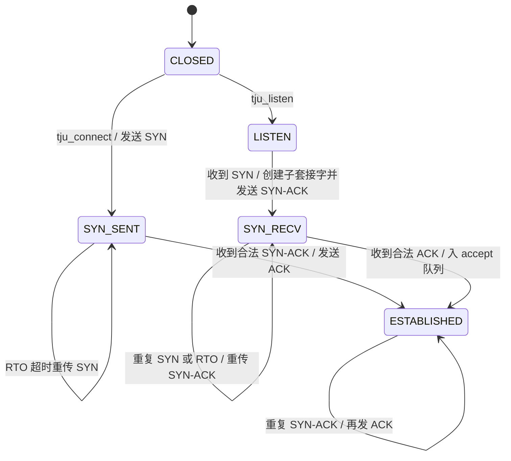
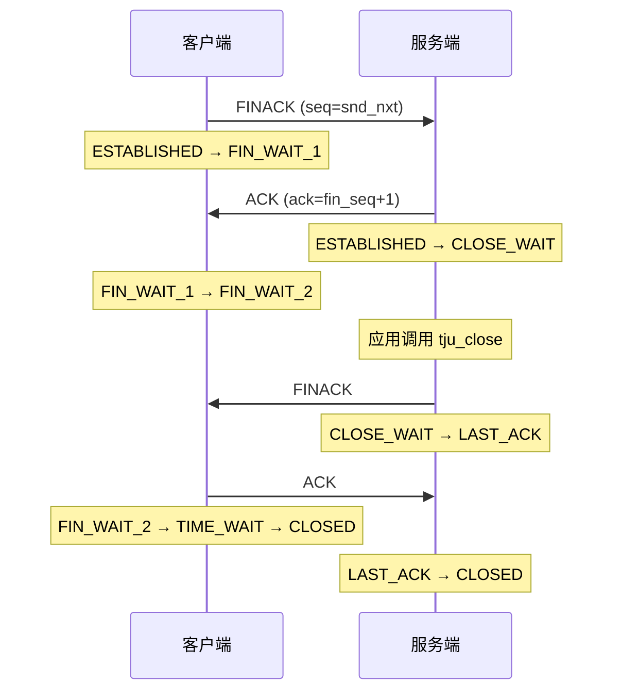
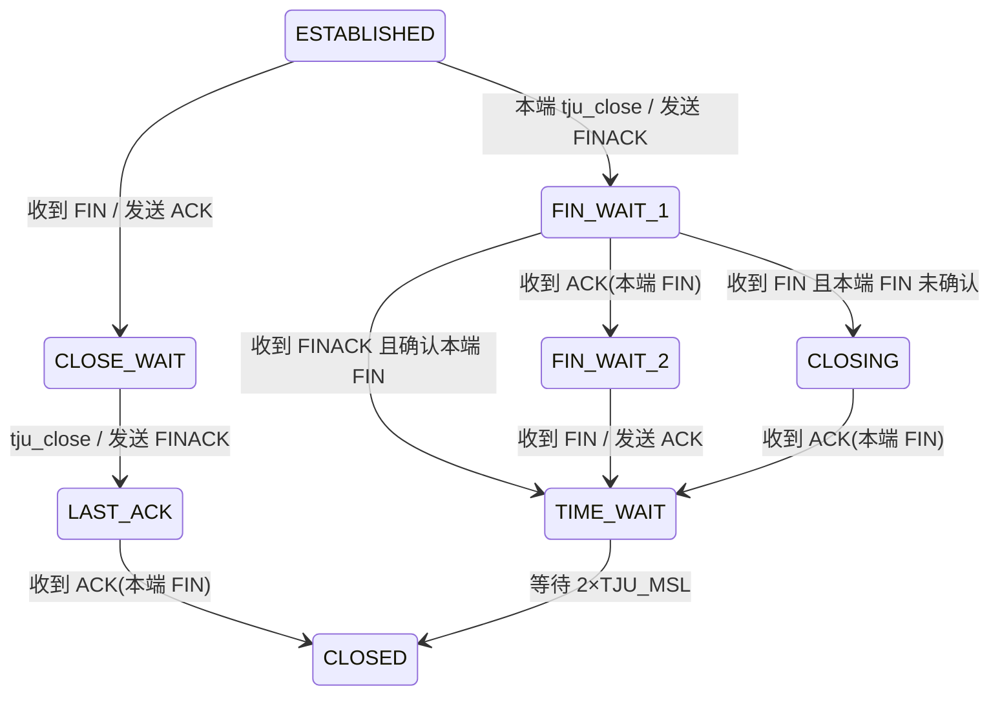

# 第五部分　连接管理的设计与实现（第二阶段 · 子任务一）

> 用途：将本节内容填入《计算机网络实践课程报告模版-2026-V3》**第五部分**；同步更新 **2.2 需求追踪矩阵 R1**、**附录 B 第二阶段**。  
> 对应代码：`tju_tcp/inc/global.h`、`tju_tcp/src/tju_tcp.c`；演示入口：`tju_tcp/src/client.c`、`tju_tcp/src/server.c`。  
> 原始日志：`tju_tcp/logs/conn_simultaneous.log`、`conn_sequential.log`、`conn_loss30.log`。  
> 实验日期：2026-09-07。网络默认：时延 20 ms、带宽 100 Mbps；丢包实验另行标注。

---

## 2.2 需求追踪矩阵（本子任务更新 R1）

| ID | 任务要求 | 报告对应章节 | 实现模块 | 测试/结果 |
|----|----------|--------------|----------|-----------|
| R1 | 连接建立与关闭 | 5.1–5.4 | `src/tju_tcp.c`：`tju_connect` / `tju_listen` / `tju_accept` / `tju_close` / `tju_handle_packet`；`inc/global.h` 连接控制字段 | TC-C1～TC-C5；日志 `conn_sequential.log`、`conn_simultaneous.log`、`conn_loss30.log`。正常握手、先后关闭、同时关闭及 30% 丢包下 SYN 重传均已通过 |

R2–R5 仍待第二阶段子任务二与第三阶段填写。

---

## 5.1 连接建立

### 5.1.1 设计依据与教学裁剪

依据 RFC 9293 §3.4–3.5 与说明书 §5.1，实现基本三次握手。SYN 占用 1 个序号；确认号表示对方下一个期望序号。教学裁剪（不实现）：同时打开、旧重复 SYN、建立期间崩溃恢复、半开放连接发现、RST。

### 5.1.2 三次握手与序号关系

设客户端 ISN 为 \(ISS_c\)，服务端 ISN 为 \(ISS_s\)。标志位沿用框架宏：`SYN=0x8`、`ACK=0x4`、`FIN=0x2`。

| 报文 | 发送方 | flags | seq | ack | 发送后本端序号 |
|------|--------|-------|-----|-----|----------------|
| SYN | 客户端 | 0x8 | \(ISS_c\) | 0 | \(snd\_nxt=ISS_c+1\) |
| SYN-ACK | 服务端 | 0xC | \(ISS_s\) | \(ISS_c+1\) | \(snd\_nxt=ISS_s+1\) |
| ACK | 客户端 | 0x4 | \(ISS_c+1\) | \(ISS_s+1\) | 不消耗序号 |

实验 TC-C1 实测：\(ISS_c=2746931794\)，\(ISS_s=2073751751\)，SYN-ACK 的 ack 为 2746931795，第三报文 ack 为 2073751752，与上表一致。

### 5.1.3 ISN 选择

`generate_isn()` 合成三类分量，禁止对所有连接使用同一常量：

1. 单调时钟：`tv_sec` 左移后与 `tv_usec` 异或；
2. 连接四元组：本地/远端 IP 与端口混合；
3. 本地不可预测分量：`rand()` 两次异或。

三次独立实验得到的客户端 ISN 分别为 2746931794、3260252363、893464451，互不相同。

### 5.1.4 状态转换与接口阻塞



- `tju_connect`：登记 `established_socks` 后发送 SYN，在 `wait_cond` 上阻塞，直至 `ESTABLISHED` 或失败。
- `tju_listen`：置 `LISTEN` 并写入 `listen_socks`。
- `tju_accept`：从监听套接字的 `accept_q` 取出已完成握手的子套接字；队列空则阻塞。
- 子套接字由收包路径 `tju_handle_packet(LISTEN, SYN)` 调用 `tju_socket()` 新建，**禁止** `memcpy` 整个 `tju_tcp_t`（互斥量不可复制）。

报文分发仍走框架 `onTCPPocket`：已登记四元组优先命中 `established_socks`，否则按监听二元组命中 `listen_socks`。因此 SYN-ACK 必须在登记子套接字之后发送，第三次 ACK 才能交给子连接而非监听套接字。

### 5.1.5 握手丢包与重传

每条连接维护一个控制报文副本 `saved_pkt` 与单一定时线程（禁止“每报文一线程”）：

- 初始 RTO = 1 s（RFC 6298 / 说明书 §5.3）；
- 超时后重传当前未确认控制报文，RTO 加倍，上限 8 s，最多 8 次；
- `SYN_SENT` / `SYN_RECV` 发生重传时置 `syn_retransmitted`；
- 连接建立后若 SYN 曾重传，数据阶段将 RTO 重新初始化为 3 s（说明书 §5.1 第 7 款 / RFC 6298 规则 5.7）。

重复报文：

- `SYN_RECV` 再收到 SYN：重发 SYN-ACK；
- `ESTABLISHED` 再收到 SYN-ACK（第三次 ACK 丢失）：再发有效 ACK。

实现位置：`send_ctrl`、`retrans_loop`、`tju_handle_packet`（`src/tju_tcp.c`）。

---

## 5.2 连接关闭

### 5.2.1 设计依据与教学裁剪

依据 RFC 9293 §3.6 与说明书 §5.2。两个方向各自用 FIN 关闭，每个 FIN 占用 1 个序号并必须得到确认。FIN 与 ACK 合并发送，标志为 `FIN|ACK=0x6`（验收所称 FINACK）。`tju_close` 之后不再接受新的 `tju_send`；本阶段发送缓冲尚未按可靠传输排队，无待发数据时立即发送 FIN。教学裁剪：关闭过程崩溃恢复、SO_LINGER、RST。

`TJU_MSL_SEC=1`，主动关闭方 TIME-WAIT 等待 \(2\times TJU\_MSL=2\) s 后再释放（说明书允许课程缩短 MSL；平台若另有规定可只改该宏）。

### 5.2.2 先后关闭与同时关闭

**先后关闭（客户端主动）：**



**同时关闭：** 双方在 ESTABLISHED 均已发出 FIN 后进入 FIN_WAIT_1；再收到对方 FIN 时，若尚未确认本端 FIN 则进入 CLOSING，确认后进入 TIME-WAIT；双方都要经历 TIME-WAIT。



### 5.2.3 FIN 前数据与资源释放

关闭前已由 `tju_send` 发出的数据排在 FIN 之前：`tju_send` 推进 `snd_nxt`，FIN 使用关闭时刻的 `snd_nxt`。可靠交付与重传属于子任务二；本阶段保证 FIN 序号位于已提交数据之后。

`tju_close` 在 TIME-WAIT 到期或被动方进入 CLOSED 后，从 `established_socks` 摘除本连接。重复 FIN 在 TIME-WAIT 中再次回复 ACK。

实现位置：`tju_close`、`handle_incoming_fin`、`enter_time_wait`、`unregister_established`。

---

## 5.3 设计—实现—测试汇总表

| 机制 | 设计要点 | 实现文件/函数 | 测试用例 | 结果/证据 |
|------|----------|---------------|----------|-----------|
| 连接建立 | 三次握手；SYN 占 1 序号；变化 ISN；accept 队列 | `tju_connect`、`tju_listen`、`tju_accept`、`tju_handle_packet` | TC-C1 | 通过。图 5-1 / `conn_sequential.log` |
| 连接建立过程中丢包 | 重复 SYN 重发 SYN-ACK；重复 SYN-ACK 再发 ACK | `tju_handle_packet`（SYN_RECV / ESTABLISHED 分支） | TC-C2 | 通过。服务端对重复 SYN 再发 SYN-ACK，`conn_loss30.log` |
| 连接建立重传 | 初始 RTO=1 s，指数退避；SYN 重传后数据阶段 RTO=3 s | `retrans_loop`、`tju_connect` | TC-C2 | 通过。客户端 `RETRANS` 间隔 1.01 s，随后 `RTO_RESET3S` |
| 连接关闭 | FINACK；先后/同时关闭；TIME-WAIT=2 s | `tju_close`、`handle_incoming_fin` | TC-C3、TC-C4 | 通过。图 5-2、图 5-3 |
| 连接关闭过程中丢包 | 关闭状态机在 30% 丢包下仍收敛 | 同上 | TC-C5 | 通过。`conn_loss30.log` 完整进入 CLOSED |
| 连接关闭重传 | FIN 使用同一控制报文定时器 | `send_ctrl(..., save=1)`、`retrans_loop` | TC-C5（机制已部署） | 本轮 30% 实验 FIN 未被丢弃故未触发 RETRANS；逻辑与 SYN 重传共用 |

---

## 5.4 功能测试

**公共环境：** 宿主机 Windows 10；client `172.17.0.2`、server `172.17.0.3`；共享目录编译后复制到 `~/` 运行。

```bash
# 两端
cd /vagrant/tju_tcp && make
# server
cp /vagrant/tju_tcp/server ~/server && chmod +x ~/server && ~/server
# client（约 5 s 内启动）
cp /vagrant/tju_tcp/client ~/client && chmod +x ~/client && ~/client
# 仅握手+关闭（避免尚未实现的可靠传输在丢包下卡住）
~/server hs
~/client hs
```

结构化日志字段：相对墙钟、hostname、事件、状态、seq、ack、flags。写入 stdout 与 `/vagrant/tju_tcp/logs/conn.log`。

### 5.4.1 连接建立测试

**TC-C1　无丢包三次握手**

- 条件：默认 20 ms / 100 Mbps / 0% 丢包。先 server 后 client。
- 流程：`tju_listen` → `tju_accept` 阻塞；`tju_connect` 发送 SYN。
- 预期：SYN / SYN-ACK / ACK 字段正确，两端 ESTABLISHED，`tju_accept` 返回子套接字。
- 实际：与预期一致。ISN 非恒定。两端随后仍能互发 `hello world` / `hello tju`。

关键日志（摘自 `conn_sequential.log` / 同时关闭实验同类，ISN 不同）：

```
client SEND  SYN_SENT     seq=3260252363 ack=0          flags=0x8
server RECV  LISTEN       seq=3260252363 ack=0          flags=0x8
server SEND  SYN_RECV     seq=2247750173 ack=3260252364 flags=0xc
client RECV  SYN_SENT     seq=2247750173 ack=3260252364 flags=0xc
client SEND  SYN_SENT     seq=3260252364 ack=2247750174 flags=0x4
client ESTAB ESTABLISHED  seq=3260252364 ack=2247750174 flags=0x4
server ESTAB ESTABLISHED  seq=2247750174 ack=3260252364 flags=0x4
server ACCEPT ESTABLISHED
```

**图 5-1　三次握手时序（TC-C1）**  
客户端 SYN（0x8）→ 服务端 SYN-ACK（0xC，ack=ISSc+1）→ 客户端 ACK（0x4，ack=ISSs+1）。两端进入 ESTABLISHED 后 `tju_accept` 返回。

**TC-C2　握手丢包与重传（30% 丢包）**

- 条件：两端 `sudo tcset enp0s8 --rate 100Mbps --delay 20ms --loss 30% --overwrite`；运行 `~/server hs` 与 `~/client hs`。
- 流程：观察 SYN 是否超时重传、重复 SYN 是否引发 SYN-ACK、建立后是否 `RTO_RESET3S`。
- 预期：握手最终成功；RTO 约 1 s 起跳；SYN 重传后 RTO 置 3 s。
- 实际：通过。客户端首个 SYN 丢失，1.01 s 后 `RETRANS`；服务端先收到 SYN 并回 SYN-ACK，再收到重复 SYN 后再次发送 SYN-ACK，随后本端定时器也 `RETRANS` SYN-ACK；第三次 ACK 到达后 ESTABLISHED；客户端打印 `RTO_RESET3S`。

```
client SEND     SYN_SENT  seq=893464451 ack=0         flags=0x8
client RETRANS  SYN_SENT  seq=893464451 ack=0         flags=0x8   # +1.01s
server RECV     LISTEN    seq=893464451 ack=0         flags=0x8
server SEND     SYN_RECV  seq=135686838 ack=893464452 flags=0xc
server RECV     SYN_RECV  seq=893464451 ack=0         flags=0x8   # 重复 SYN
server SEND     SYN_RECV  seq=135686838 ack=893464452 flags=0xc
server RETRANS  SYN_RECV  seq=135686838 ack=893464452 flags=0xc
client ESTAB / RTO_RESET3S
```

测试后已恢复：`sudo tcset enp0s8 --rate 100Mbps --delay 20ms --overwrite`。

### 5.4.2 连接关闭测试

**TC-C3　双方先后关闭（客户端主动）**

- 条件：0% 丢包；服务端在 `tju_recv` 之后 `sleep(3)` 再 `tju_close`。
- 预期：客户端 FIN_WAIT_1 → FIN_WAIT_2 → TIME_WAIT（2 s）→ CLOSED；服务端 CLOSE_WAIT → LAST_ACK → CLOSED（无 TIME-WAIT）。FINACK 的 ack 为本端下一期望序号，对端 ACK 等于 `fin_seq+1`。
- 实际：通过。

```
# 客户端主动
client SEND_FIN  FIN_WAIT_1   seq=3260252386 ack=2247750196 flags=0x6
client TO_FIN_WAIT2           seq=2247750196 ack=3260252387 flags=0x4
client RECV FIN  FIN_WAIT_2   seq=2247750196 ack=3260252387 flags=0x6
client TIME_WAIT / TW_EXPIRED (+2.00s) CLOSED

# 服务端被动
server TO_CLOSE_WAIT CLOSE_WAIT seq=3260252386 ack=2247750196 flags=0x6
server SEND_FIN      LAST_ACK   seq=2247750196 ack=3260252387 flags=0x6
server CLOSED                   seq=3260252387 ack=2247750197 flags=0x4
```

**图 5-2　先后四次挥手（TC-C3）**  
① 客户端 FINACK → ② 服务端 ACK → ③ 约 3 s 后服务端 FINACK → ④ 客户端 ACK。主动方 TIME-WAIT 实测 2.00 s。

**TC-C4　双方同时关闭**

- 条件：0% 丢包；两端在数据收齐后几乎同时 `tju_close`（服务端当时未加延时）。
- 预期：双方 FIN_WAIT_1，收到对方 FIN 后进入 CLOSING，再收到本端 FIN 的 ACK 后进入 TIME-WAIT，2 s 后 CLOSED。
- 实际：通过。见 `conn_simultaneous.log`。

```
client SEND_FIN FIN_WAIT_1 flags=0x6
server SEND_FIN FIN_WAIT_1 flags=0x6
client TO_CLOSING / TIME_WAIT / TW_EXPIRED CLOSED
server TO_CLOSING / TIME_WAIT / TW_EXPIRED CLOSED
```

**图 5-3　同时关闭（TC-C4）**  
交叉 FINACK 使双方进入 CLOSING，再交换对 FIN 的 ACK 后共同进入 TIME-WAIT。

**TC-C5　关闭过程丢包**

- 条件：与 TC-C2 相同，30% 丢包，`hs` 模式。
- 预期：关闭状态机收敛到 CLOSED；FIN 丢失则由控制报文定时器重传。
- 实际：本轮 FIN/ACK 均到达，未出现 FIN 的 `RETRANS`，但先后关闭完整完成（客户端 TIME-WAIT，服务端 LAST_ACK→CLOSED）。FIN 重传与 SYN 共用 `saved_pkt` 定时器，TC-C2 已验证该定时器行为。

失败项：无。未单独构造“仅丢第三次 ACK”或“仅丢 FIN”的精准丢包脚本；重复 SYN / SYN-ACK 路径已在 TC-C2 覆盖。

---

## 5.5 代表性 AI 协作与验证记录

| 项目 | 内容 |
|------|------|
| 所在阶段 | 第二阶段 · 子任务一（编程实现 + 测试诊断） |
| 工具信息 | Cursor（Grok 4.6） |
| 使用目的 | 按说明书 §5.1–5.2 与指导书 §6.2.1 补全框架中被直接置为 ESTABLISHED 的握手/挥手骨架，并对照 RFC 9293 检查状态机 |
| 提示与上下文摘要 | 提供 `tju_tcp.c` 原有 `tju_accept`/`tju_connect` 硬编码地址的注释、标志宏、`onTCPPocket` 四元组分发约束，以及验收对 FINACK、ISN、RTO=3 s 的要求 |
| AI 建议摘要 | ① 监听套接字维护 accept 队列，握手在 `tju_handle_packet` 完成；② 用条件变量阻塞 `connect`/`accept`/`close`；③ 控制报文保存副本并由定时线程重传；④ ISN 混合时钟、四元组与随机量 |
| 人工处理 | **采用** accept 队列、条件变量、单连接单定时器。**拒绝** 为每个报文创建线程（指导书明确列为常见错误）。**修改** 原框架 `memcpy(listen_sock)` 建连方式，改为 `tju_socket()` 重新初始化锁。**补强** SYN 重传后 `RTO_RESET3S`、重复 SYN-ACK 再确认、CLOSING 同时关闭。未让 AI 为“过测试”删除状态检查 |
| 验证方法 | `make` 编译通过；TC-C1～TC-C5 实机运行；日志核对 seq/ack/flags 与状态名；30% 丢包下观察到 SYN `RETRANS` 与 `RTO_RESET3S` |
| 关联证据 | `src/tju_tcp.c`；`logs/conn_*.log`；本节 5.3–5.4 |

---

## 附录 B　第二阶段进度摘要（子任务一）

| 阶段 | 完成内容 | 未完成/遗留问题 | 下一步 |
|------|----------|-----------------|--------|
| 第二阶段（进行中） | 三次握手、变化 ISN、握手 RTO 重传与重复报文处理；先后/同时关闭、FINACK、TIME-WAIT=2×TJU_MSL；`tju_connect`/`accept`/`close` 阻塞语义；本地 TC-C1～TC-C5 | 可靠数据传输、校验和、流量控制未做；FIN 单独丢包未做精准故障注入；`TJU_MSL` 以课程平台最终值为准 | 子任务二：发送/接收缓冲、累计确认、RFC 6298 RTT/RTO、超时与快速重传、通告窗口与零窗口探测 |

---

## 实现与复现说明（不写入报告正文的操作备忘）

1. 可修改边界：未改 `kernel.c`（除未动 `cal_hash`）、未改 `tju_packet.c` 函数；仅在 `global.h` 的 `tju_tcp_t` **追加**字段与 `TJU_MSL_SEC` 等宏，未改动既有状态宏、`MAX_LEN`、标志位。
2. 演示程序默认路径仍为短字符串互发 + 先后关闭；`hs` 参数仅用于丢包下的纯连接管理实验。
3. 共享文件夹中的 `./client`、`./server` 请复制到 `~/` 再执行。
4. 提交 Git 时请在模板首页更新 commit-id（本文件撰写时尚未按用户要求执行 commit）。
