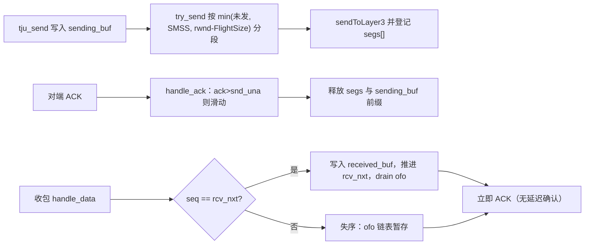
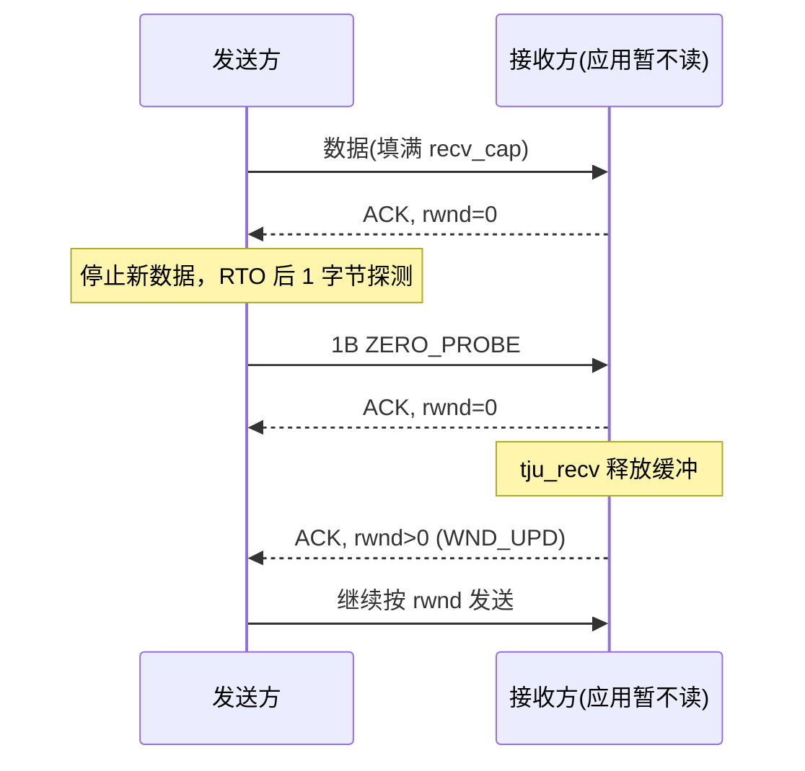

# 第六部分　可靠数据传输与流量控制的设计与实现（第二阶段 · 子任务二）

> 用途：将本节内容填入《计算机网络实践课程报告模版-2026-V3》**第六部分**；同步更新 **2.2 需求追踪矩阵 R2、R3**、**附录 B 第二阶段**。  
> 对应代码：`tju_tcp/inc/global.h`、`tju_tcp/src/tju_tcp.c`；实验入口：`tju_tcp/test/test_rdt_*.c`、`test/flow_client.c`、`test/flow_server.c`。  
> 原始日志：`tju_tcp/logs/rdt_autotest.log`、`tju_tcp/logs/flow_trace.log`。  
> 实验日期：2026-09-08。自动测试网络：时延 300 ms、丢包 10%、带宽 100 Mbps；流量控制实验：时延 20 ms、接收缓冲 2500 B。

---

## 2.2 需求追踪矩阵（本子任务更新 R2、R3）

| ID | 任务要求 | 报告对应章节 | 实现模块 | 测试/结果 |
|----|----------|--------------|----------|-----------|
| R1 | 连接建立与关闭 | 5.1–5.4 | `src/tju_tcp.c`：`tju_connect` / `tju_listen` / `tju_accept` / `tju_close` / `tju_handle_packet` | TC-C1～TC-C5 已通过；本子任务回归：`./test/test establish` **100**、`./test/test close` **100** |
| R2 | 可靠数据传输 | 6.1–6.3、6.6 | `tju_send` / `tju_recv` / `handle_data` / `handle_ack` / `try_send` / `update_rtt` / `do_retransmit`；`inc/global.h` 发送缓冲、失序队列、在途报文表 | TC-R1：本地自动测试 `./test/test rdt`，50 条报文、10% 丢包、300 ms 时延，**100 分**。日志 `rdt_autotest.log` |
| R3 | 流量控制 | 6.4、6.7 | `calc_adv_wnd`、`peer_rwnd` 约束 `try_send`、零窗口探测 `ZERO_PROBE`、窗口更新 `WND_UPD` | TC-F1：`TJU_RECV_CAP=2500`，先填满接收缓冲再慢读。通告窗口 2500→0，探测后恢复。服务端实收 20480 B。日志 `flow_trace.log` |

R4–R5 仍待第三阶段填写。

---

## 6.1 序号、确认与发送/接收缓冲区

### 6.1.1 字节序号与累计确认

数据阶段在握手完成后的字节流上推进序号。SYN 已占用 \(ISS\)，因此 ESTABLISHED 后 `snd_una = snd_nxt = ISS+1`，`rcv_nxt = IRS+1`。此后每个数据字节占用一个序号；纯 ACK 不占用序号；FIN 占用 1 个序号且排在已提交数据之后（`tju_close` 先等待 `sending_len==0` 再发 FINACK）。

确认号为接收端**下一个期望字节**。比较采用 RFC 1982 串行号算术（`(int32_t)(a-b)`），避免 32 位回绕误判。



### 6.1.2 缓冲区与滑动窗口

说明书 §7：发送/接收缓冲均不得小于 \(5000\times SMSS\)。实现取 `SMSS=1375`（与 `MAX_DLEN` 一致，保证 `plen≤MAX_LEN`），`SEND_BUF_SIZE = RECV_BUF_SIZE = 5000×1375`。`sending_buf[0]` 对应 `snd_una`；在途量 `FlightSize = snd_nxt − snd_una`；未发送量为 `sending_len − FlightSize`。

`tju_send` 在缓冲满时于 `wait_cond` 上阻塞，直至 ACK 释放空间；全部 `len` 写入缓冲后才返回。`tju_recv` 按流交付，返回实际读出字节数；应用一次读 16 B、协议一次发 1375 B 均合法。

失序报文放入按序号排序的 `ofo` 链表；仅当 `seq==rcv_nxt` 时写入 `received_buf` 并向应用交付。完全重复或已交付区间被丢弃但仍回 ACK。每个字节只向应用交付一次。

在途报文副本保存在 `segs[MAX_INFLIGHT]`（窗口上限 65535 B，约 48 个满载段，128 足够），供超时重传与快速重传使用。禁止“每报文一线程”。

实现位置：`try_send`、`handle_data`、`ofo_insert` / `ofo_drain`、`tju_send` / `tju_recv`。

---

## 6.2 校验、丢包检测与重传

### 6.2.1 校验和

说明书 §5.3 要求按第 4 章校验 checksum，但第 4 章 20 字节头仅有 8 位 `ext`，无 16 位 checksum 字段。第一阶段曾设想在头后插入 2 字节前缀；该方案会使控制报文 `plen=22`，可能与验收程序对 SYN/FIN 长度的检查冲突。

本实现：对**整个报文**（计算时将 `ext` 置 0）做 RFC 1071 16 位反码求和，将高低字节异或折成 8 位置入 `ext`；若折合结果为 0 则写入 `0xFF`。接收时若 `ext==0` 则放行（验收程序发出的控制报文该字段为 0）；否则不符则丢弃，不更新状态、不修改缓冲、不回 ACK。

双方均为学生代码的 RDT 路径会互发非零 `ext`，校验生效。

### 6.2.2 超时重传与快速重传

每条连接**一个**定时线程 `retrans_loop`，用 `timer_cond` 的 `pthread_cond_timedwait` 等待当前 RTO；ACK 推进时广播该条件变量以按 RFC 6298 **重启**定时器。

- **超时**：重传 `segs[0]`（最早未确认段），RTO 加倍，上限 60 s；该段标记 `retransmitted`，不再用于 RTT 采样（Karn）。
- **三次重复 ACK**：`ack==snd_una` 且无新数据时 `dupacks++`；达到 `DUPACK_THRESH=3` 立即重传最早未确认段（基本快速重传）。本阶段不实现完整快速恢复（窗口膨胀属第三阶段挑战任务）。
- 失序到达立即回当前 `rcv_nxt` 的 ACK，以尽快触发对端快速重传。
- 全部在途数据确认后停止数据定时器（`need_timer` 为假则 `cond_wait`）。

控制报文（SYN/FIN）仍走 `saved_pkt`，与数据重传共用同一线程。

---

## 6.3 RTT、RTO 与重传定时器

依据 RFC 6298，变量单位为微秒，时钟粒度 \(G=1000\,\mu s\)。

| 阶段 | 规则 |
|------|------|
| 无样本 | `RTO = 1 s` |
| 首个有效样本 \(R\) | `SRTT=R`，`RTTVAR=R/2`，`RTO=SRTT+max(G,4×RTTVAR)` |
| 后续样本 | 先 `RTTVAR=(1−β)RTTVAR+β\|SRTT−R\|`（β=1/4），再 `SRTT=(1−α)SRTT+αR`（α=1/8） |
| 上下限 | `RTO ∈ [1 s, 60 s]` |
| Karn | 仅从未重传段采样；每 RTT 最多跟踪一个 `timed_seq` |
| 超时 | RTO 加倍后重传最早未确认段并重启定时器 |
| SYN 曾重传 | 进入数据阶段先将 RTO 置 3 s（RFC 6298 规则 5.7），随后仍可被样本更新 |

流量控制实验中，20 ms 单向时延下首个 RTT 样本约 48 ms；因下限 1 s，RTO 保持 1 s，符合 RFC 建议的最小值。零窗口首次探测间隔约 1.00 s，与当时 RTO 一致。

实现位置：`update_rtt`、`drop_acked_segs`、`do_retransmit`、`retrans_loop`。

---

## 6.4 流量控制

第二阶段发送上限由 **rwnd** 约束（尚未引入 cwnd）。通告窗口为 16 位，取 \(\min(\text{接收缓冲空闲}, 65535)\)，禁止把大于 65535 的空闲截断成回绕值。

**接收端 SWS：** 空闲大于 0 但小于一个 SMSS 时通告 0，避免通告“几个字节”的小窗口。`tju_recv` 读走数据后，若窗口从 0 恢复或跨越 SMSS，发送窗口更新 ACK（`WND_UPD`）。

**发送端：** `usable = peer_rwnd − FlightSize`；`usable==0` 时不发新数据。若窗口为 0 且仍有未发送数据、在途为 0，则在一个 RTO 后发送 **1 字节探测**，随后探测间隔指数增长。接收方对探测回应当前 `rcv_nxt` 与当前窗口。只要对端持续响应探测，不因窗口持续为 0 而关闭连接。

**窗口缩小：** 发送方按最新 `peer_rwnd` 计算 usable；为负或 0 时停止发新数据，但仍重传未确认段。

实现位置：`calc_adv_wnd`、`try_send`、`handle_ack`（窗口更新时即使 ACK 未推进也调用 `try_send`）、`tju_recv`。



---

## 6.5 设计—实现—测试汇总表

| 机制 | 设计要点 | 实现文件/函数 | 测试用例 | 证据 |
|------|----------|---------------|----------|------|
| 累计确认 / 失序重组 | 字节序号；ofo 暂存；仅按序写入 `received_buf` | `handle_data`、`ofo_insert` / `ofo_drain` | TC-R1 | 50 条 `test message0`～`49` 按序出现在 server 日志 |
| 快速 / 超时重传 | 三次 dup ACK 重传 segs[0]；RTO 重传并加倍 | `handle_ack`、`do_retransmit` | TC-R1、TC-F1 | RDT 10% 丢包仍满分；`flow_trace.log` 含 `FAST_REXMIT`、`RTO_REXMIT` |
| RTT / RTO | RFC 6298 + Karn；单连接单定时器 | `update_rtt`、`retrans_loop` | TC-F1 | 首样本约 48 ms，RTO 下限 1 s；探测间隔 ≈1.00 s |
| 流量控制 / 零窗口 | 16 位通告；SWS；探测与窗口更新 | `calc_adv_wnd`、`try_send`、`tju_recv` | TC-F1 | 通告 2500→0→1536 循环；服务端收齐 20480 B |

---

## 6.6 可靠传输测试

**公共环境：** 宿主机 Windows 10；client `172.17.0.2`、server `172.17.0.3`；在 **client** 虚拟机执行本地自动测试包。

```bash
cd /vagrant/tju_tcp
./test/test rdt
```

### TC-R1　自动测试 RDT（满分项）

- **条件：** 测试程序先启动 `rdt_server` / `rdt_client` 并等待 5 s 完成握手（此时仍为默认 20 ms / 0% 丢包），再将两端设置为 `100Mbps / delay 300ms / loss 10%`，再等待 40 s 后杀进程评分。
- **负载：** 客户端 `sleep(8)` 后连续 `tju_send` 50 次、每次 16 B，内容为 `test message%d\n`；服务端 `tju_recv` 每次 16 B，打印 `[RDT TEST] server recv %s`。两端均不调用 `tju_close`（进程被测试框架终止）。
- **评分：** 日志中每出现 `[RDT TEST] server recv test message{i}`（i=0…49）得 2 分，满分 100。
- **预期：** 10% 丢包与约 600 ms RTT 下，累计确认、超时/快速重传使 50 条均按序交付。
- **实际：** 通过，**100 分**。

```
{"scores": {"establish_connection": 0, "close_connection":0, "reliable_data_transfer":100}}
```

服务端日志摘录（`tju_tcp/logs/rdt_autotest.log`）：`test message0` 至 `test message49` 连续完整。`Interrupted` 来自测试程序 `sleep_no_wake` 被杀进程打断，不影响计分。

**回归：** 同版本代码 `./test/test establish` → 建立连接 **100**；`./test/test close` → 断开连接 **100**（先后 60 + 同时 40）。可靠传输未破坏握手与挥手。

**关于 100 MB：** 说明书要求在丢包/时延下可靠传输不少于 100 MB。自动测试本地包的 RDT 项为 50×16 B。本实现已按 5000×SMSS 分配缓冲、按 16 位窗口流水发送，具备大文件传输所需机制；100 MB 将在第三阶段联调与性能测试中按课程文件复测，本子任务不以缩小数据量规避自动测试。

失败项：无。

---

## 6.7 流量控制测试

### TC-F1　小接收缓冲、零窗口探测与恢复

- **条件：** `TJU_RECV_CAP=2500`（环境变量，仅实验用；自动测试不设置，仍为 5000×SMSS）。两端 `delay 20ms`、0% 丢包。`TJU_TRACE=/vagrant/tju_tcp/logs/flow_trace.log`。
- **流程：** 服务端 `tju_accept` 后 **sleep(6 s)** 不读；客户端一次提交 20×1024 B。6 s 后服务端每次读 256 B 并 `usleep(150 ms)`，制造窗口反复开关。
- **预期：** 通告窗口随占用下降至 0；发送方发出 1 B 探测；应用读取后发送 `WND_UPD`；发送方不超过 rwnd；最终交付 20480 B。
- **实际：** 通过。`[FLOW] server got 20480 bytes`。

关键日志（`flow_trace.log`，相对事件）：

```
server SEND_CTRL  wnd=2500     # SYN-ACK 通告等于 recv_cap
server SEND_CTRL  wnd=1476 rlen=1024
server SEND_CTRL  wnd=0    rlen=2048   # 空闲 < SMSS，SWS 通告 0
client ACK_ADV    wnd=0    una 追上 nxt，停止新数据
client ZERO_PROBE len=1         # 约 1.00 s 后首次探测
server WND_UPD    wnd=1536 rlen=964    # 应用开始读
client SEND_DATA  len=1375+160         # 按打开的窗口继续发
# 之后多次 0 → 1536 循环，直至 slen=0
client SEND_CTRL  FIN_WAIT_1           # 数据全部确认后才发 FIN
```

**图 6-1　零窗口与探测（TC-F1）**  
接收缓冲 2500 B，SWS 使通告在空闲不足 SMSS 时变为 0；发送方在一个 RTO 后发送 1 字节探测；`tju_recv` 后窗口更新为 1536，发送方继续受 rwnd 约束直至 20 KB 交付完毕。

调试中曾出现“窗口更新 ACK 的确认号未推进，被当成重复 ACK 而 `return`、不再 `try_send`”，导致窗口打开后发送方停滞。已改为：即使 `ack==snd_una` 也根据最新 `peer_rwnd` 调用 `try_send`。修复后本实验收齐 20480 B，RDT 自动测试仍为 100 分。

---

## 6.8 代表性 AI 协作与验证记录

| 项目 | 内容 |
|------|------|
| 所在阶段 | 第二阶段 · 子任务二（编程实现 + 测试诊断） |
| 工具信息 | Cursor（Grok 4.6） |
| 使用目的 | 按说明书 §5.3–5.4 与指导书 §6.2.2 实现缓冲、累计确认、RFC 6298、快速/超时重传与流量控制，并对接本地自动测试 `rdt` |
| 提示与上下文摘要 | 提供自动测试二进制反编译结果（50 条、先握手再 10%/300 ms、按日志计分）、既有握手/挥手状态机、`ext` 无 16 位校验和字段、指导书“禁止每报文一线程” |
| AI 建议摘要 | ① 发送缓冲 + 单一定时线程 + `segs[]` 副本；② 失序链表；③ RFC 6298 整数实现 Karn；④ 16 位通告与 1 字节零窗口探测；⑤ 校验和折入 `ext` 并兼容验收 `ext=0` |
| 人工处理 | **采用** 单连接单定时器、累计确认、三次 dup ACK 快速重传。**拒绝** 在头后插入 2 字节校验前缀（会改变控制报文 plen）。**拒绝** 为过测试删除丢包处理。**修改** 窗口更新 ACK 必须触发 `try_send`（对照实验：修复前 20 KB 停滞，修复后收齐）。未实现完整快速恢复 |
| 验证方法 | `make` 通过；`./test/test rdt` 100 分（修复后复测仍 100）；establish/close 回归 100；TC-F1 日志核对 wnd=0、ZERO_PROBE、WND_UPD |
| 关联证据 | `src/tju_tcp.c`；`logs/rdt_autotest.log`；`logs/flow_trace.log`；本节 6.5–6.7 |

---

## 附录 B　第二阶段进度摘要（子任务一+二）

| 阶段 | 完成内容 | 未完成/遗留问题 | 下一步 |
|------|----------|-----------------|--------|
| 第二阶段（本周完成） | 子任务一：三次握手、挥手、TIME-WAIT。子任务二：发送/接收缓冲、累计确认、失序重组、8 位折合校验和、RFC 6298 RTT/RTO 与 Karn、超时与三次 dup ACK 快速重传、16 位通告窗口、SWS、零窗口探测。自动测试 establish/close/rdt 均为 100 | 100 MB 文件未在本周用课程测试文件完整跑完；基础 Reno（cwnd/ssthresh）属第三阶段；校验和因头部无 16 位字段采用 `ext` 折合并兼容验收 | 第三阶段：基础 Reno；100 MB 与对照性能实验；补齐报告第七、八部分 |

---

## 实现与复现说明（不写入报告正文的操作备忘）

1. 可修改边界：未改 `kernel.c`（`cal_hash` 保持无符号取模）、未改 `tju_packet.c` 函数；`global.h` 仅**追加**宏与字段。
2. 校验和写入 `ext`；验收程序控制报文 `ext=0` 不丢弃。
3. 本地自动测试必须在 **client** 执行：`cd /vagrant/tju_tcp && ./test/test rdt`。
4. 流量控制实验：`TJU_RECV_CAP=2500 TJU_TRACE=...` 运行 `test/flow_server` 与 `test/flow_client`（不要加入 `test/Makefile`，以免干扰自动测试编译）。
5. 共享目录中的二进制请复制到 `~/` 再执行。
6. 提交 Git 时请在模板首页更新 commit-id。
